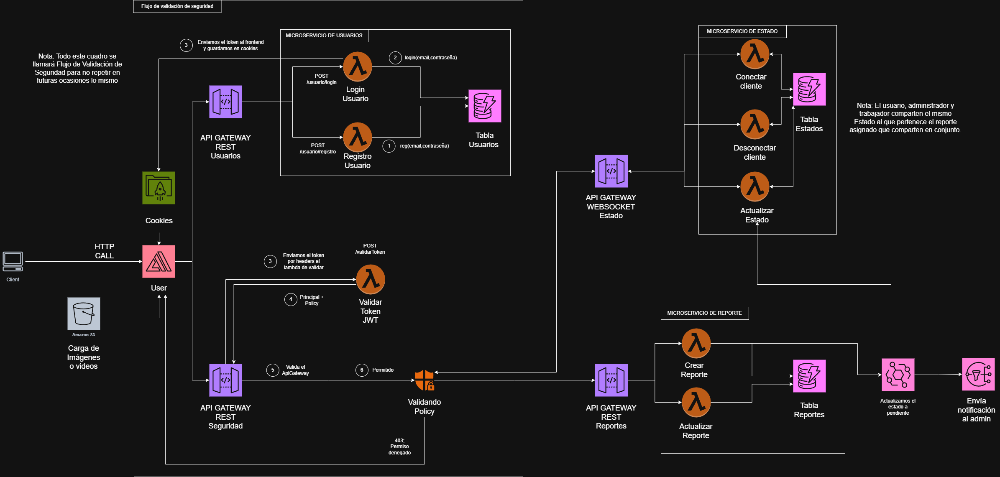
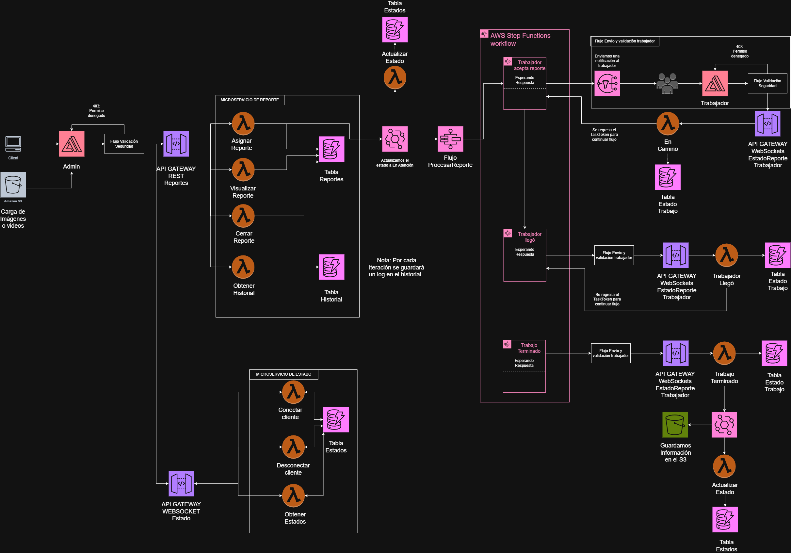
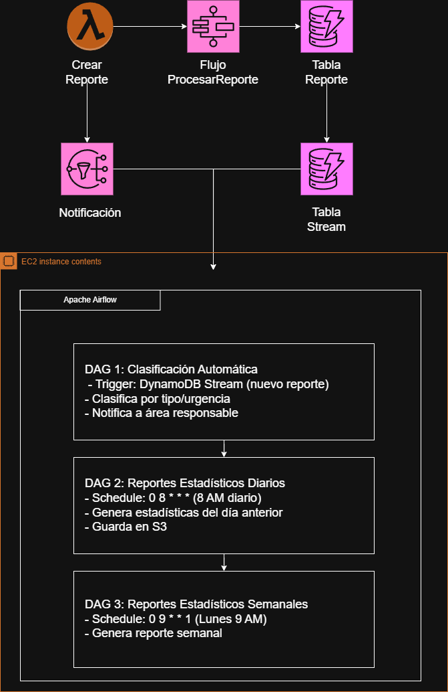

# 📚 Guía de Integración Frontend - Sistema de Gestión de Incidentes

**API REST + WebSocket para actualizaciones en tiempo real**

---

## 📋 Tabla de Contenidos

1. [Configuración Inicial](#configuración-inicial)
2. [Arquitectura del Sistema](#arquitectura-del-sistema)
   - [Diagrama de Arquitectura General](#diagrama-de-arquitectura-general)
   - [Flujo Completo: Admin y Trabajador](#flujo-completo-admin-y-trabajador)
3. [Endpoints REST API](#endpoints-rest-api)
4. [WebSocket - Actualizaciones en Tiempo Real](#websocket---actualizaciones-en-tiempo-real)
5. [Flujos Completos por Rol](#flujos-completos-por-rol)
6. [Filtros y Búsqueda](#filtros-y-búsqueda)
7. [Manejo de Errores](#manejo-de-errores)
8. [Ejemplos de Código](#ejemplos-de-código)
9. [Apache Airflow - Orquestación y Automatización](#-apache-airflow---orquestación-y-automatización)
   - [Integración con el Sistema Serverless](#integración-con-el-sistema-serverless)
10. [Notificaciones SNS](#-notificaciones-sns-simple-notification-service)

---

## 🔧 Configuración Inicial

### URLs Base

```javascript
// REST API
const API_BASE_URL = 'https://iufx6tx21g.execute-api.us-east-1.amazonaws.com/dev';

// WebSocket API
const WS_BASE_URL = 'wss://z7unrfb2ub.execute-api.us-east-1.amazonaws.com/dev';
```

**Nota:** Estas URLs pueden cambiar después de cada despliegue. Verifica los endpoints actuales en la salida de `sls deploy`.

---

## 🏗️ Arquitectura del Sistema

### Diagrama de Arquitectura General

La siguiente imagen muestra la arquitectura completa del sistema con los microservicios principales, flujo de validación de seguridad, y componentes AWS:



**Componentes principales:**
- **Microservicio de Usuarios**: Maneja registro y autenticación (excluido en esta implementación)
- **Microservicio de Estado**: Gestiona conexiones WebSocket y estados en tiempo real
- **Microservicio de Reporte**: Procesa creación, actualización y gestión de reportes
- **Flujo de Validación de Seguridad**: Valida tokens JWT y políticas (excluido en esta implementación)

### Componentes Principales

```
┌─────────────────────────────────────────────────────────┐
│                    FRONTEND                              │
│  ┌──────────────┐  ┌──────────────┐  ┌──────────────┐  │
│  │   Usuario    │  │ Administrador│  │  Trabajador  │  │
│  └──────┬───────┘  └──────┬───────┘  └──────┬───────┘  │
└─────────┼──────────────────┼──────────────────┼─────────┘
          │                  │                  │
          │ REST API         │ REST API         │ WebSocket
          │                  │                  │
┌─────────┼──────────────────┼──────────────────┼─────────┐
│         ▼                  ▼                  ▼          │
│  ┌──────────────────────────────────────────────────┐   │
│  │         API Gateway (REST + WebSocket)          │   │
│  └──────────────────────────────────────────────────┘   │
│         │                  │                  │          │
│         ▼                  ▼                  ▼          │
│  ┌──────────┐      ┌──────────┐      ┌──────────┐      │
│  │ Lambda   │      │ Lambda   │      │ Lambda   │      │
│  │ Reportes │      │ Estado   │      │ Trabajo  │      │
│  └────┬─────┘      └────┬─────┘      └────┬─────┘      │
│       │                 │                 │            │
│       └─────────────────┼─────────────────┘            │
│                         │                               │
│                         ▼                               │
│              ┌─────────────────────┐                    │
│              │    DynamoDB         │                    │
│              │  - Reportes         │                    │
│              │  - Estados          │                    │
│              │  - Historial        │                    │
│              │  - Estado Trabajo   │                    │
│              │  - Conexiones       │                    │
│              └─────────────────────┘                    │
└─────────────────────────────────────────────────────────┘
```

### Flujo Completo: Admin y Trabajador

La siguiente imagen detalla el flujo completo del sistema incluyendo:
- **Panel Administrativo**: Visualización, filtrado y asignación de reportes
- **Flujo de Trabajador**: Proceso completo desde asignación hasta finalización usando AWS Step Functions
- **WebSocket para Trabajadores**: Actualizaciones en tiempo real del estado del trabajo
- **Historial y Trazabilidad**: Registro completo de todas las acciones



**Flujos principales:**
1. **Creación de Reporte** → Actualización de estado a "pendiente" → Notificación al admin
2. **Asignación de Trabajador** → Inicio de Step Functions → Notificación al trabajador
3. **Workflow Step Functions**: 
   - Trabajador acepta reporte → Estado "en camino"
   - Trabajador llegó → Estado "llegó"
   - Trabajo terminado → Guardado en S3 → Estado "resuelto"
4. **Actualizaciones en Tiempo Real**: WebSocket notifica cambios a todos los clientes conectados

### Tablas DynamoDB

| Tabla | Propósito | Clave Principal |
|-------|-----------|-----------------|
| `TablaReportes` | Almacena todos los reportes | `reporte_id` |
| `TablaEstados` | Historial de estados de cada reporte | `reporte_id` + `timestamp` |
| `TablaHistorial` | Auditoría de todas las acciones | `reporte_id` + `timestamp_accion` |
| `TablaEstadoTrabajo` | Estado del trabajador asignado | `reporte_id` + `trabajador_id` |
| `TablaConexiones` | Conexiones WebSocket activas | `connection_id` |

---

## 📡 Endpoints REST API

### Base URL
```
https://iufx6tx21g.execute-api.us-east-1.amazonaws.com/dev
```

Todos los endpoints soportan **CORS** y devuelven JSON.

---

### 1. Crear Reporte

**POST** `/reportes`

**Request Body:**
```json
{
  "usuario_id": "user-123",
  "tipo": "seguridad" | "mantenimiento" | "limpieza" | "otro",
  "ubicacion": "Edificio A, Aula 201",
  "descripcion": "Descripción detallada del incidente",
  "nivel_urgencia": "baja" | "media" | "alta" | "critica",
  "rol": "estudiante" | "personal" | "administrativo",
  "imagenes": ["url1", "url2"],  // Opcional
  "videos": ["url1"]              // Opcional
}
```

**Response (201):**
```json
{
  "reporte_id": "uuid-generado",
  "fecha_creacion": "2024-01-15T10:30:00Z",
  "estado": "pendiente",
  "mensaje": "Reporte creado exitosamente"
}
```

**Ejemplo JavaScript:**
```javascript
async function crearReporte(datos) {
  const response = await fetch(`${API_BASE_URL}/reportes`, {
    method: 'POST',
    headers: {
      'Content-Type': 'application/json'
    },
    body: JSON.stringify(datos)
  });
  
  if (!response.ok) {
    const error = await response.json();
    throw new Error(error.error || 'Error al crear reporte');
  }
  
  return await response.json();
}

// Uso
const nuevoReporte = await crearReporte({
  usuario_id: 'user-123',
  tipo: 'seguridad',
  ubicacion: 'Edificio A, Aula 201',
  descripcion: 'Puerta rota en el aula',
  nivel_urgencia: 'alta',
  rol: 'estudiante'
});
```

---

### 2. Listar Reportes (con Filtros)

**GET** `/reportes`

**Query Parameters:**
- `usuario_id` (opcional): Filtrar por usuario
- `estado` (opcional): `pendiente` | `en_atencion` | `resuelto`
- `tipo` (opcional): `seguridad` | `mantenimiento` | `limpieza` | `otro`
- `nivel_urgencia` (opcional): `baja` | `media` | `alta` | `critica`
- `orderBy` (opcional): `urgencia` (default) | `fecha` - Ordenamiento de resultados
- `limit` (opcional): Número de resultados (default: 50)
- `lastKey` (opcional): Para paginación

**Ordenamiento:**
- `orderBy=urgencia` (default): Ordena por nivel de urgencia (critica > alta > media > baja), luego por fecha más reciente
- `orderBy=fecha`: Ordena solo por fecha de creación (más reciente primero)

**Ejemplos de URLs:**
```
GET /reportes
GET /reportes?estado=pendiente
GET /reportes?tipo=seguridad&nivel_urgencia=alta
GET /reportes?usuario_id=user-123
GET /reportes?estado=pendiente&tipo=mantenimiento&limit=20
GET /reportes?estado=pendiente&orderBy=urgencia  # Ordenar por urgencia (default)
GET /reportes?estado=pendiente&orderBy=fecha     # Ordenar solo por fecha
```

**Response (200):**
```json
{
  "total": 25,
  "limit": 50,
  "has_more": false,
  "last_key": null,
  "reportes": [
    {
      "reporte_id": "uuid",
      "fecha_creacion": "2024-01-15T10:30:00Z",
      "usuario_id": "user-123",
      "tipo": "seguridad",
      "ubicacion": "Edificio A, Aula 201",
      "descripcion": "Descripción...",
      "nivel_urgencia": "alta",
      "estado": "pendiente",
      "trabajador_asignado": "",
      "fecha_actualizacion": "2024-01-15T10:30:00Z",
      "imagenes": [],
      "videos": []
    }
  ]
}
```

**Ejemplo JavaScript:**
```javascript
async function listarReportes(filtros = {}) {
  const params = new URLSearchParams();
  
  if (filtros.usuario_id) params.append('usuario_id', filtros.usuario_id);
  if (filtros.estado) params.append('estado', filtros.estado);
  if (filtros.tipo) params.append('tipo', filtros.tipo);
  if (filtros.nivel_urgencia) params.append('nivel_urgencia', filtros.nivel_urgencia);
  if (filtros.orderBy) params.append('orderBy', filtros.orderBy); // 'urgencia' o 'fecha'
  if (filtros.limit) params.append('limit', filtros.limit);
  if (filtros.lastKey) params.append('lastKey', filtros.lastKey);
  
  const response = await fetch(`${API_BASE_URL}/reportes?${params}`);
  
  if (!response.ok) {
    throw new Error('Error al listar reportes');
  }
  
  return await response.json();
}

// Uso
const reportesPendientes = await listarReportes({ estado: 'pendiente' }); // Ordenado por urgencia (default)
const reportesUsuario = await listarReportes({ usuario_id: 'user-123' });
const reportesFiltrados = await listarReportes({
  estado: 'pendiente',
  tipo: 'seguridad',
  nivel_urgencia: 'alta',
  limit: 20
});

// Ordenar por urgencia (prioriza críticos y altos)
const reportesPorUrgencia = await listarReportes({
  estado: 'pendiente',
  orderBy: 'urgencia' // critica > alta > media > baja, luego por fecha
});

// Ordenar solo por fecha
const reportesPorFecha = await listarReportes({
  estado: 'pendiente',
  orderBy: 'fecha' // Más recientes primero
});
```

---

### 3. Visualizar Reporte

**GET** `/reportes/{reporte_id}`

**Response (200):**
```json
{
  "reporte": {
    "reporte_id": "uuid",
    "fecha_creacion": "2024-01-15T10:30:00Z",
    "usuario_id": "user-123",
    "tipo": "seguridad",
    "ubicacion": "Edificio A, Aula 201",
    "descripcion": "Descripción...",
    "nivel_urgencia": "alta",
    "estado": "pendiente",
    "trabajador_asignado": "",
    "fecha_actualizacion": "2024-01-15T10:30:00Z",
    "imagenes": [],
    "videos": []
  },
  "estado_actual": {
    "reporte_id": "uuid",
    "timestamp": "2024-01-15T10:30:00Z",
    "estado": "pendiente",
    "detalles_estado": [...]
  }
}
```

---

### 4. Obtener Reporte Completo (Recomendado)

**GET** `/reportes/{reporte_id}/completo`

**Response (200):**
```json
{
  "reporte": { /* información del reporte */ },
  "estado_actual": { /* estado más reciente */ },
  "estados": [ /* historial completo de estados */ ],
  "estado_trabajo": {
    "reporte_id": "uuid",
    "trabajador_id": "trabajador-001",
    "estado_trabajo": "en_camino",
    "fecha_en_camino": "2024-01-15T11:00:00Z",
    "ubicacion_trabajador": {
      "latitud": -12.0464,
      "longitud": -77.0428,
      "timestamp": "2024-01-15T11:00:00Z"
    }
  },
  "historial_reciente": [ /* últimas 10 acciones */ ],
  "total_acciones_historial": 15
}
```

**Ejemplo JavaScript:**
```javascript
async function obtenerReporteCompleto(reporteId) {
  const response = await fetch(`${API_BASE_URL}/reportes/${reporteId}/completo`);
  
  if (!response.ok) {
    throw new Error('Error al obtener reporte');
  }
  
  return await response.json();
}
```

---

### 5. Actualizar Reporte

**PUT** `/reportes/{reporte_id}`

**Request Body:**
```json
{
  "descripcion": "Descripción actualizada",
  "nivel_urgencia": "critica",
  "imagenes": ["url-nueva"],
  "videos": ["url-nueva"]
}
```

**Response (200):**
```json
{
  "mensaje": "Reporte actualizado exitosamente",
  "reporte_id": "uuid"
}
```

---

### 6. Asignar Trabajador (Solo Administrador)

**POST** `/reportes/{reporte_id}/asignar`

**Request Body:**
```json
{
  "trabajador_id": "trabajador-001",
  "usuario_id": "admin-001",
  "rol": "administrativo"
}
```

**Response (200):**
```json
{
  "mensaje": "Trabajador asignado exitosamente",
  "reporte_id": "uuid",
  "trabajador_id": "trabajador-001",
  "execution_arn": "arn:aws:states:..."
}
```

**Nota:** Esto inicia el workflow de Step Functions y el trabajador recibirá notificaciones.

---

### 7. Cerrar Reporte (Solo Administrador)

**POST** `/reportes/{reporte_id}/cerrar`

**Request Body:**
```json
{
  "user_id": "admin-001",
  "rol": "administrativo",
  "notes": "Reporte resuelto completamente"
}
```

**Response (200):**
```json
{
  "mensaje": "Reporte cerrado exitosamente",
  "reporte_id": "uuid"
}
```

---

### 8. Obtener Historial

**GET** `/reportes/{reporte_id}/historial`

**Response (200):**
```json
{
  "reporte_id": "uuid",
  "total_acciones": 10,
  "historial": [
    {
      "timestamp_accion": "2024-01-15T10:30:00Z",
      "accion": "crear",
      "usuario_id": "user-123",
      "rol": "estudiante",
      "entidad_afectada": "reporte",
      "detalles_antes": {},
      "detalles_despues": { /* reporte completo */ },
      "notas": "Reporte creado inicialmente",
      "ip_address": "192.168.1.1",
      "user_agent": "Mozilla/5.0..."
    }
  ]
}
```

---

## 🔌 WebSocket - Actualizaciones en Tiempo Real

### URL Base
```
wss://z7unrfb2ub.execute-api.us-east-1.amazonaws.com/dev
```

### Conexión

**URL de Conexión:**
```javascript
// Monitorear un reporte específico
const wsUrl = `${WS_BASE_URL}?reporte_id=${reporteId}&usuario_id=${usuarioId}`;

// Monitorear TODOS los reportes (Panel Admin)
const wsUrl = `${WS_BASE_URL}?usuario_id=${usuarioId}`;
```

**Eventos WebSocket:**
- `$connect`: Se ejecuta automáticamente al conectar
- `$disconnect`: Se ejecuta automáticamente al desconectar
- `$default`: Para enviar mensajes personalizados

---

### 1. Conectar y Escuchar Actualizaciones

**Ejemplo JavaScript Vanilla:**
```javascript
class WebSocketManager {
  constructor(reporteId = null, usuarioId = null) {
    this.reporteId = reporteId;
    this.usuarioId = usuarioId;
    this.ws = null;
    this.reconnectAttempts = 0;
    this.maxReconnectAttempts = 5;
  }

  connect() {
    let url = `${WS_BASE_URL}`;
    const params = [];
    
    if (this.reporteId) {
      params.push(`reporte_id=${this.reporteId}`);
    }
    if (this.usuarioId) {
      params.push(`usuario_id=${this.usuarioId}`);
    }
    
    if (params.length > 0) {
      url += `?${params.join('&')}`;
    }

    this.ws = new WebSocket(url);

    this.ws.onopen = () => {
      console.log('✅ WebSocket conectado');
      this.reconnectAttempts = 0;
      this.onConnect();
    };

    this.ws.onmessage = (event) => {
      try {
        const data = JSON.parse(event.data);
        this.handleMessage(data);
      } catch (error) {
        console.error('Error parsing WebSocket message:', error);
      }
    };

    this.ws.onerror = (error) => {
      console.error('❌ Error WebSocket:', error);
      this.onError(error);
    };

    this.ws.onclose = () => {
      console.log('🔌 WebSocket desconectado');
      this.onDisconnect();
      this.attemptReconnect();
    };
  }

  handleMessage(data) {
    switch (data.tipo) {
      case 'actualizacion_estado':
        // Actualización de estado en tiempo real
        this.onEstadoUpdate(data);
        break;
      
      case 'respuesta_estados':
        // Respuesta a obtenerEstados
        this.onEstadosResponse(data);
        break;
      
      default:
        console.log('Mensaje recibido:', data);
    }
  }

  // Solicitar estados de un reporte
  obtenerEstados(reporteId) {
    if (this.ws && this.ws.readyState === WebSocket.OPEN) {
      this.ws.send(JSON.stringify({
        action: 'obtenerEstados',
        reporte_id: reporteId
      }));
    }
  }

  disconnect() {
    if (this.ws) {
      this.ws.close();
      this.ws = null;
    }
  }

  attemptReconnect() {
    if (this.reconnectAttempts < this.maxReconnectAttempts) {
      this.reconnectAttempts++;
      const delay = Math.min(1000 * Math.pow(2, this.reconnectAttempts), 30000);
      console.log(`Reintentando conexión en ${delay}ms...`);
      setTimeout(() => this.connect(), delay);
    }
  }

  // Callbacks (sobrescribir en tu implementación)
  onConnect() {}
  onDisconnect() {}
  onError(error) {}
  onEstadoUpdate(data) {}
  onEstadosResponse(data) {}
}

// Uso
const wsManager = new WebSocketManager(null, 'user-123'); // Monitorear todos
wsManager.onEstadoUpdate = (data) => {
  console.log('Estado actualizado:', data);
  // Actualizar UI: actualizar solo el reporte específico
  actualizarReporteEnUI(data.reporte_id, data.estado);
};
wsManager.connect();
```

---

### 2. Obtener Estados de un Reporte

**Enviar mensaje:**
```javascript
ws.send(JSON.stringify({
  action: 'obtenerEstados',
  reporte_id: 'uuid-del-reporte'
}));
```

**Respuesta recibida:**
```json
{
  "tipo": "respuesta_estados",
  "reporte_id": "uuid",
  "reporte": {
    "reporte_id": "uuid",
    "tipo": "seguridad",
    "ubicacion": "Edificio A",
    "estado": "en_atencion",
    "trabajador_asignado": "trabajador-001"
  },
  "estados": [
    {
      "reporte_id": "uuid",
      "timestamp": "2024-01-15T11:00:00Z",
      "estado": "en_atencion",
      "detalles_estado": [...]
    }
  ],
  "estado_actual": { /* estado más reciente */ },
  "estado_trabajo": {
    "trabajador_id": "trabajador-001",
    "estado_trabajo": "en_camino",
    "fecha_en_camino": "2024-01-15T11:00:00Z"
  },
  "timestamp": "2024-01-15T11:05:00Z"
}
```

---

### 3. Actualizaciones Automáticas en Tiempo Real

Cuando cambia el estado de un reporte, **automáticamente** recibirás:

```json
{
  "tipo": "actualizacion_estado",
  "reporte_id": "uuid",
  "estado": "en_atencion",
  "timestamp": "2024-01-15T11:00:00Z",
  "timestamp_notificacion": "2024-01-15T11:00:01Z"
}
```

**No necesitas hacer polling.** El sistema envía actualizaciones automáticamente a todas las conexiones activas que monitorean ese reporte.

---

### 4. WebSocket para Trabajadores

Los trabajadores usan rutas específicas para actualizar su estado:

**Ruta: `enCamino`**
```javascript
ws.send(JSON.stringify({
  action: 'enCamino',
  reporte_id: 'uuid',
  trabajador_id: 'trabajador-001',
  task_token: 'token-del-step-functions',
  ubicacion_trabajador: {
    latitud: -12.0464,
    longitud: -77.0428
  }
}));
```

**Ruta: `trabajadorLlego`**
```javascript
ws.send(JSON.stringify({
  action: 'trabajadorLlego',
  reporte_id: 'uuid',
  trabajador_id: 'trabajador-001',
  task_token: 'token-del-step-functions'
}));
```

**Ruta: `trabajoTerminado`**
```javascript
ws.send(JSON.stringify({
  action: 'trabajoTerminado',
  reporte_id: 'uuid',
  trabajador_id: 'trabajador-001',
  task_token: 'token-del-step-functions',
  comentarios: 'Trabajo completado exitosamente',
  imagenes_finales: ['url1', 'url2']
}));
```

---

## 👥 Flujos Completos por Rol

### 🔵 Flujo: Usuario (Estudiante/Personal)

#### 1. Crear Reporte
```javascript
// 1. Usuario crea un reporte
const reporte = await crearReporte({
  usuario_id: 'user-123',
  tipo: 'mantenimiento',
  ubicacion: 'Edificio B, Baño 2do piso',
  descripcion: 'Grifo roto, gotea constantemente',
  nivel_urgencia: 'media',
  rol: 'estudiante'
});

console.log('Reporte creado:', reporte.reporte_id);
```

#### 2. Conectar WebSocket para Monitorear
```javascript
// 2. Conectar WebSocket para recibir actualizaciones
const wsManager = new WebSocketManager(reporte.reporte_id, 'user-123');

wsManager.onEstadoUpdate = (data) => {
  // Actualizar UI cuando cambie el estado
  if (data.reporte_id === reporte.reporte_id) {
    actualizarEstadoEnUI(data.estado);
    mostrarNotificacion(`Estado actualizado: ${data.estado}`);
  }
};

wsManager.connect();
```

#### 3. Ver Mis Reportes
```javascript
// 3. Listar mis reportes
const misReportes = await listarReportes({
  usuario_id: 'user-123'
});

// Mostrar en lista
misReportes.reportes.forEach(reporte => {
  mostrarReporteEnLista(reporte);
});
```

#### 4. Ver Detalle de un Reporte
```javascript
// 4. Ver información completa de un reporte
const detalle = await obtenerReporteCompleto(reporte.reporte_id);

// Mostrar:
// - Información del reporte
// - Estado actual
// - Estado del trabajador (si está asignado)
// - Historial de acciones
mostrarDetalleReporte(detalle);
```

---

### 🟢 Flujo: Administrador

#### 1. Ver Panel de Reportes (con Filtros y Priorización)
```javascript
// 1. Cargar todos los reportes pendientes ordenados por urgencia
// Los reportes críticos y de alta urgencia aparecerán primero
const reportesPendientes = await listarReportes({
  estado: 'pendiente',
  orderBy: 'urgencia', // Prioriza: critica > alta > media > baja
  limit: 50
});

// Mostrar en tabla/lista (ya vienen ordenados por prioridad)
mostrarReportesEnTabla(reportesPendientes.reportes);
```

#### 2. Conectar WebSocket para Actualizaciones en Tiempo Real
```javascript
// 2. Conectar WebSocket para TODOS los reportes
const wsManager = new WebSocketManager(null, 'admin-001'); // null = todos

wsManager.onEstadoUpdate = (data) => {
  // Actualizar SOLO el reporte que cambió en la lista
  actualizarReporteEnLista(data.reporte_id, {
    estado: data.estado,
    timestamp: data.timestamp
  });
  
  // Mostrar notificación
  mostrarNotificacion(`Reporte ${data.reporte_id} actualizado: ${data.estado}`);
};

wsManager.connect();
```

#### 3. Filtrar y Priorizar Reportes
```javascript
// 3. Aplicar filtros con priorización
async function aplicarFiltros(filtros) {
  const reportes = await listarReportes({
    estado: filtros.estado,        // 'pendiente', 'en_atencion', 'resuelto'
    tipo: filtros.tipo,            // 'seguridad', 'mantenimiento', etc.
    nivel_urgencia: filtros.urgencia, // 'baja', 'media', 'alta', 'critica'
    orderBy: filtros.orderBy || 'urgencia', // 'urgencia' o 'fecha'
    limit: 50
  });
  
  // Los reportes ya vienen ordenados por prioridad
  actualizarListaReportes(reportes.reportes);
}

// Ejemplo: Filtrar por urgencia alta, ordenados por urgencia
aplicarFiltros({
  estado: 'pendiente',
  urgencia: 'alta',
  orderBy: 'urgencia' // Los críticos aparecen antes que los altos
});

// Ejemplo: Ver todos los pendientes priorizados
aplicarFiltros({
  estado: 'pendiente',
  orderBy: 'urgencia' // critica > alta > media > baja
});
```

#### 4. Asignar Trabajador
```javascript
// 4. Asignar trabajador a un reporte
async function asignarTrabajador(reporteId, trabajadorId) {
  try {
    const resultado = await fetch(`${API_BASE_URL}/reportes/${reporteId}/asignar`, {
      method: 'POST',
      headers: { 'Content-Type': 'application/json' },
      body: JSON.stringify({
        trabajador_id: trabajadorId,
        usuario_id: 'admin-001',
        rol: 'administrativo'
      })
    });
    
    if (resultado.ok) {
      mostrarExito('Trabajador asignado exitosamente');
      // El WebSocket automáticamente recibirá la actualización
    }
  } catch (error) {
    mostrarError('Error al asignar trabajador');
  }
}
```

#### 5. Cerrar Reporte
```javascript
// 5. Cerrar un reporte
async function cerrarReporte(reporteId) {
  const resultado = await fetch(`${API_BASE_URL}/reportes/${reporteId}/cerrar`, {
    method: 'POST',
    headers: { 'Content-Type': 'application/json' },
    body: JSON.stringify({
      user_id: 'admin-001',
      rol: 'administrativo',
      notes: 'Reporte resuelto completamente'
    })
  });
  
  if (resultado.ok) {
    mostrarExito('Reporte cerrado');
  }
}
```

---

### 🟡 Flujo: Trabajador

#### 1. Conectar WebSocket
```javascript
// 1. Trabajador se conecta
const ws = new WebSocket(`${WS_BASE_URL}?usuario_id=trabajador-001`);
```

#### 2. Recibir Asignación (vía SNS o polling)
```javascript
// 2. El trabajador puede ver sus reportes asignados
const misTrabajos = await listarReportes({
  // Nota: Necesitarías un endpoint adicional o filtrar por trabajador_asignado
});

// O verificar reportes específicos
const reporte = await obtenerReporteCompleto(reporteId);
if (reporte.reporte.trabajador_asignado === 'trabajador-001') {
  mostrarReporteAsignado(reporte);
}
```

#### 3. Actualizar Estado: En Camino
```javascript
// 3. Trabajador indica que está en camino
function marcarEnCamino(reporteId, taskToken, ubicacion) {
  ws.send(JSON.stringify({
    action: 'enCamino',
    reporte_id: reporteId,
    trabajador_id: 'trabajador-001',
    task_token: taskToken,
    ubicacion_trabajador: {
      latitud: ubicacion.lat,
      longitud: ubicacion.lng
    }
  }));
}
```

#### 4. Actualizar Estado: Llegó
```javascript
// 4. Trabajador indica que llegó
function marcarLlego(reporteId, taskToken) {
  ws.send(JSON.stringify({
    action: 'trabajadorLlego',
    reporte_id: reporteId,
    trabajador_id: 'trabajador-001',
    task_token: taskToken
  }));
}
```

#### 5. Actualizar Estado: Trabajo Terminado
```javascript
// 5. Trabajador marca trabajo como terminado
function marcarTerminado(reporteId, taskToken, comentarios, imagenes) {
  ws.send(JSON.stringify({
    action: 'trabajoTerminado',
    reporte_id: reporteId,
    trabajador_id: 'trabajador-001',
    task_token: taskToken,
    comentarios: comentarios,
    imagenes_finales: imagenes
  }));
}
```

---

## 🔍 Filtros y Búsqueda

### Filtros Disponibles en `GET /reportes`

| Parámetro | Valores | Descripción |
|-----------|---------|-------------|
| `usuario_id` | String | Filtrar reportes de un usuario específico |
| `estado` | `pendiente`, `en_atencion`, `resuelto` | Filtrar por estado |
| `tipo` | `seguridad`, `mantenimiento`, `limpieza`, `otro` | Filtrar por tipo |
| `nivel_urgencia` | `baja`, `media`, `alta`, `critica` | Filtrar por urgencia |
| `orderBy` | `urgencia` (default), `fecha` | Ordenamiento de resultados |
| `limit` | Número (default: 50) | Límite de resultados |
| `lastKey` | String | Para paginación |

**Ordenamiento por Urgencia (`orderBy=urgencia`):**
- Prioriza reportes críticos y de alta urgencia
- Orden: `critica` > `alta` > `media` > `baja`
- Si tienen la misma urgencia, ordena por fecha más reciente
- **Recomendado para panel administrativo**

### Ejemplos de Filtros Combinados

```javascript
// Reportes pendientes ordenados por urgencia (recomendado para admin)
const urgentes = await listarReportes({
  estado: 'pendiente',
  orderBy: 'urgencia' // critica y alta aparecen primero
});

// Reportes de seguridad en atención ordenados por fecha
const seguridad = await listarReportes({
  tipo: 'seguridad',
  estado: 'en_atencion',
  orderBy: 'fecha' // más recientes primero
});

// Mis reportes pendientes (ordenados por urgencia por defecto)
const misPendientes = await listarReportes({
  usuario_id: 'user-123',
  estado: 'pendiente'
});

// Panel admin: Todos los pendientes priorizados por urgencia
const panelAdmin = await listarReportes({
  estado: 'pendiente',
  orderBy: 'urgencia', // Los críticos y altos aparecen primero
  limit: 50
});
```

---

## ⚠️ Manejo de Errores

### Códigos HTTP Comunes

| Código | Significado | Acción Recomendada |
|--------|-------------|-------------------|
| 200 | Éxito | Continuar |
| 201 | Creado | Éxito en POST |
| 400 | Bad Request | Validar datos enviados |
| 404 | No encontrado | Verificar ID |
| 500 | Error del servidor | Reintentar o notificar |

### Ejemplo de Manejo de Errores

```javascript
async function llamadaAPI(url, options = {}) {
  try {
    const response = await fetch(url, options);
    
    if (!response.ok) {
      const error = await response.json().catch(() => ({
        error: `HTTP ${response.status}`,
        mensaje: response.statusText
      }));
      
      throw new Error(error.error || error.mensaje || 'Error desconocido');
    }
    
    return await response.json();
  } catch (error) {
    if (error.name === 'TypeError' && error.message.includes('fetch')) {
      throw new Error('Error de conexión. Verifica tu internet.');
    }
    throw error;
  }
}

// Uso con manejo de errores
try {
  const reporte = await llamadaAPI(`${API_BASE_URL}/reportes`, {
    method: 'POST',
    headers: { 'Content-Type': 'application/json' },
    body: JSON.stringify(datos)
  });
  console.log('Éxito:', reporte);
} catch (error) {
  console.error('Error:', error.message);
  mostrarErrorAlUsuario(error.message);
}
```

---

## 💻 Ejemplos de Código

### React Hook para WebSocket

```javascript
import { useEffect, useRef, useState } from 'react';

function useWebSocket(reporteId = null, usuarioId = null) {
  const [estado, setEstado] = useState('desconectado');
  const [ultimaActualizacion, setUltimaActualizacion] = useState(null);
  const wsRef = useRef(null);

  useEffect(() => {
    let url = `${WS_BASE_URL}`;
    const params = [];
    
    if (reporteId) params.push(`reporte_id=${reporteId}`);
    if (usuarioId) params.push(`usuario_id=${usuarioId}`);
    
    if (params.length > 0) url += `?${params.join('&')}`;

    wsRef.current = new WebSocket(url);

    wsRef.current.onopen = () => {
      setEstado('conectado');
    };

    wsRef.current.onmessage = (event) => {
      const data = JSON.parse(event.data);
      
      if (data.tipo === 'actualizacion_estado') {
        setUltimaActualizacion(data);
        // Disparar evento personalizado
        window.dispatchEvent(new CustomEvent('estadoActualizado', { detail: data }));
      }
    };

    wsRef.current.onerror = () => {
      setEstado('error');
    };

    wsRef.current.onclose = () => {
      setEstado('desconectado');
    };

    return () => {
      if (wsRef.current) {
        wsRef.current.close();
      }
    };
  }, [reporteId, usuarioId]);

  const enviarMensaje = (mensaje) => {
    if (wsRef.current && wsRef.current.readyState === WebSocket.OPEN) {
      wsRef.current.send(JSON.stringify(mensaje));
    }
  };

  return { estado, ultimaActualizacion, enviarMensaje };
}

// Uso en componente
function PanelReportes() {
  const { estado, ultimaActualizacion } = useWebSocket(null, 'admin-001');
  const [reportes, setReportes] = useState([]);

  useEffect(() => {
    // Cargar reportes iniciales
    listarReportes({ estado: 'pendiente' }).then(setReportes);
  }, []);

  useEffect(() => {
    // Escuchar actualizaciones
    const handler = (event) => {
      const data = event.detail;
      setReportes(prev => prev.map(r => 
        r.reporte_id === data.reporte_id
          ? { ...r, estado: data.estado }
          : r
      ));
    };
    
    window.addEventListener('estadoActualizado', handler);
    return () => window.removeEventListener('estadoActualizado', handler);
  }, []);

  return (
    <div>
      <p>Estado WebSocket: {estado}</p>
      {ultimaActualizacion && (
        <p>Última actualización: {ultimaActualizacion.reporte_id}</p>
      )}
      {/* Lista de reportes */}
    </div>
  );
}
```

### Componente React para Lista de Reportes con Filtros

```javascript
import { useState, useEffect } from 'react';

function ListaReportes() {
  const [reportes, setReportes] = useState([]);
  const [filtros, setFiltros] = useState({
    estado: '',
    tipo: '',
    nivel_urgencia: ''
  });
  const [cargando, setCargando] = useState(false);

  // Conectar WebSocket para actualizaciones
  const { ultimaActualizacion } = useWebSocket(null, 'admin-001');

  // Cargar reportes cuando cambian los filtros
  useEffect(() => {
    cargarReportes();
  }, [filtros]);

  // Actualizar cuando llega actualización WebSocket
  useEffect(() => {
    if (ultimaActualizacion) {
      setReportes(prev => prev.map(r => 
        r.reporte_id === ultimaActualizacion.reporte_id
          ? { ...r, estado: ultimaActualizacion.estado }
          : r
      ));
    }
  }, [ultimaActualizacion]);

  async function cargarReportes() {
    setCargando(true);
    try {
      const resultado = await listarReportes(filtros);
      setReportes(resultado.reportes);
    } catch (error) {
      console.error('Error:', error);
    } finally {
      setCargando(false);
    }
  }

  return (
    <div>
      {/* Filtros */}
      <div>
        <select 
          value={filtros.estado} 
          onChange={(e) => setFiltros({...filtros, estado: e.target.value})}
        >
          <option value="">Todos los estados</option>
          <option value="pendiente">Pendiente</option>
          <option value="en_atencion">En Atención</option>
          <option value="resuelto">Resuelto</option>
        </select>

        <select 
          value={filtros.tipo} 
          onChange={(e) => setFiltros({...filtros, tipo: e.target.value})}
        >
          <option value="">Todos los tipos</option>
          <option value="seguridad">Seguridad</option>
          <option value="mantenimiento">Mantenimiento</option>
          <option value="limpieza">Limpieza</option>
        </select>

        <select 
          value={filtros.nivel_urgencia} 
          onChange={(e) => setFiltros({...filtros, nivel_urgencia: e.target.value})}
        >
          <option value="">Todas las urgencias</option>
          <option value="baja">Baja</option>
          <option value="media">Media</option>
          <option value="alta">Alta</option>
          <option value="critica">Crítica</option>
        </select>
      </div>

      {/* Lista */}
      {cargando ? (
        <p>Cargando...</p>
      ) : (
        <ul>
          {reportes.map(reporte => (
            <li key={reporte.reporte_id}>
              <strong>{reporte.tipo}</strong> - {reporte.ubicacion}
              <br />
              Estado: {reporte.estado} | Urgencia: {reporte.nivel_urgencia}
            </li>
          ))}
        </ul>
      )}
    </div>
  );
}
```

---

## 📝 Notas Importantes

1. **CORS**: Todos los endpoints REST soportan CORS, puedes hacer requests desde cualquier origen.

2. **WebSocket Auto-Reconexión**: Implementa lógica de reconexión automática si la conexión se cae.

3. **Actualizaciones en Tiempo Real**: No necesitas hacer polling. El sistema envía actualizaciones automáticamente cuando cambian los estados.

4. **Filtros Combinados**: Puedes combinar múltiples filtros en `GET /reportes`.

5. **Paginación**: Usa `limit` y `lastKey` para paginar resultados grandes.

6. **Task Tokens**: Los trabajadores reciben `task_token` cuando se les asigna un reporte (vía SNS o otro mecanismo). Este token es necesario para actualizar estados.

---

## 🔄 Apache Airflow - Orquestación y Automatización

### ¿Qué es Airflow en este sistema?

Apache Airflow se encarga de tareas automatizadas que complementan el sistema serverless:

- **Clasificación Automática**: Clasifica reportes pendientes y notifica a áreas responsables
- **Reportes Estadísticos**: Genera reportes diarios y semanales automáticamente
- **Integración con DynamoDB**: Lee datos de las tablas para análisis y procesamiento

### Integración con el Sistema Serverless

La siguiente imagen muestra cómo Apache Airflow se integra con el sistema serverless:



**Flujo de integración:**
1. **Creación de Reporte** → Se guarda en `TablaReportes` → Se envía notificación SNS
2. **DynamoDB Stream** → Detecta nuevos reportes → Airflow procesa automáticamente
3. **DAG 1: Clasificación Automática**: 
   - Escanea reportes pendientes sin clasificar
   - Clasifica por tipo/urgencia
   - Notifica a área responsable vía SNS
4. **DAG 2: Reportes Estadísticos Diarios**: 
   - Se ejecuta diariamente a las 8 AM
   - Genera estadísticas del día anterior
   - Guarda en S3
5. **DAG 3: Reportes Estadísticos Semanales**: 
   - Se ejecuta los lunes a las 9 AM
   - Genera estadísticas de la semana anterior
   - Guarda en S3

### Arquitectura

```
EC2 Instance (t2.large)
├── Docker
│   ├── PostgreSQL Container (Base de datos Airflow)
│   └── Airflow Container (Webserver + Scheduler)
│       └── DAGs
│           ├── clasificar_reportes.py
│           ├── reportes_estadisticos_diarios.py
│           └── reportes_estadisticos_semanales.py
└── IAM Role (LabRole) → Acceso a DynamoDB, SNS, S3
```

### Despliegue

#### 1. Crear Stack CloudFormation

```bash
aws cloudformation create-stack \
  --stack-name airflow-hackathon-utec \
  --template-body file://plantilla_crear_mv_airflow.yaml \
  --parameters ParameterKey=InstanceName,ParameterValue=Airflow-Hackathon-UTEC
```

#### 2. Esperar a que la instancia se inicialice

El UserData script debería automáticamente:
- Instalar Docker y Docker Compose
- Descargar docker-compose.yaml oficial de Apache Airflow 2.10.3
- Inicializar Airflow
- Iniciar todos los servicios

**Nota importante**: En algunas cuentas de estudiante, el UserData script puede fallar debido a errores en la instalación de paquetes del sistema. Si esto ocurre, ver la sección "Instalación Manual" en Troubleshooting.

#### 3. Verificar que la instancia esté lista

Espera 5-10 minutos después del despliegue para que el UserData script complete la instalación. Puedes verificar el estado con:

```bash
# Verificar estado de la instancia
aws cloudformation describe-stacks \
  --stack-name airflow-hackathon-utec \
  --query 'Stacks[0].StackStatus' \
  --output text

# Obtener IP pública
aws cloudformation describe-stacks \
  --stack-name airflow-hackathon-utec \
  --query 'Stacks[0].Outputs[?OutputKey==`InstancePublicIP`].OutputValue' \
  --output text
```

#### 4. Copiar DAGs a la instancia EC2

**Opción A: Usar SCP (requiere archivo vockey.pem)**

```bash
# Obtener IP pública de la instancia
INSTANCE_IP=$(aws cloudformation describe-stacks \
  --stack-name airflow-hackathon-utec \
  --query 'Stacks[0].Outputs[?OutputKey==`InstancePublicIP`].OutputValue' \
  --output text)

# Copiar DAGs (asegúrate de tener vockey.pem en el directorio actual)
scp -i vockey.pem airflow/dags/*.py ubuntu@$INSTANCE_IP:/home/ubuntu/airflow/dags/
```

**Opción B: Crear DAGs directamente en EC2 (recomendado si no tienes vockey.pem)**

Si no tienes acceso al archivo `vockey.pem` o SCP falla, puedes crear los DAGs directamente en la EC2:

1. Conéctate a la EC2 (desde AWS Console o Systems Manager)
2. Navega al directorio de DAGs:
   ```bash
   cd /home/ubuntu/airflow/dags
   ```
3. Crea cada archivo usando `nano` o `cat`:
   ```bash
   # Usar nano para crear y editar
   nano clasificar_reportes.py
   # Pegar el contenido completo del archivo local
   # Guardar: Ctrl+X, luego Y, luego Enter
   
   nano reportes_estadisticos_diarios.py
   # Pegar contenido, guardar
   
   nano reportes_estadisticos_semanales.py
   # Pegar contenido, guardar
   ```
4. Verificar que los archivos se crearon:
   ```bash
   ls -la /home/ubuntu/airflow/dags/
   ```

Los DAGs aparecerán automáticamente en Airflow UI en 30-60 segundos.

#### 5. Verificar que los DAGs aparezcan en Airflow UI

1. Accede a `http://<EC2_IP>:8080`
2. Inicia sesión con `airflow` / `airflow`
3. Deberías ver 3 DAGs en la lista:
   - `clasificar_reportes_automatico`
   - `reportes_estadisticos_diarios`
   - `reportes_estadisticos_semanales`

Si no aparecen:
- Espera 30-60 segundos (Airflow escanea DAGs periódicamente)
- Verifica logs del scheduler: `docker compose logs airflow-scheduler | tail -20`
- Verifica que los archivos estén en `/home/ubuntu/airflow/dags/` con permisos correctos

#### 6. Verificar estado de Airflow (opcional)

```bash
# Desde la EC2, verificar contenedores
cd /home/ubuntu/airflow
docker compose ps

# Ver logs de servicios específicos
docker compose logs airflow-scheduler
docker compose logs airflow-webserver
```

#### 7. Acceder a Airflow UI

```
http://<EC2_PUBLIC_IP>:8080
```

**Credenciales por defecto:**
- Usuario: `airflow`
- Contraseña: `airflow`

**Nota:** Cambiar la contraseña después del primer acceso.

### DAGs Disponibles

#### 1. clasificar_reportes_automatico

**Schedule:** Cada 5 minutos (`*/5 * * * *`)

**Funcionalidad:**
- Escanea `TablaReportes-dev` para reportes pendientes sin clasificar
- Clasifica por tipo y asigna área responsable:
  - `seguridad` → area-seguridad@utec.edu.pe
  - `mantenimiento` → area-mantenimiento@utec.edu.pe
  - `limpieza` → area-limpieza@utec.edu.pe
  - `otro` → area-general@utec.edu.pe
- Actualiza reporte con campos `clasificado_automaticamente` y `area_responsable`
- Envía notificación SNS al área correspondiente

**Tags:** `clasificacion`, `notificaciones`, `dynamodb`

#### 2. reportes_estadisticos_diarios

**Schedule:** Diario a las 8 AM (`0 8 * * *`)

**Funcionalidad:**
- Consulta `TablaReportes-dev` y `TablaEstados-dev` del día anterior
- Calcula estadísticas:
  - Total de reportes
  - Distribución por tipo
  - Distribución por urgencia
  - Distribución por estado
  - Reportes críticos
- Genera JSON con estadísticas
- Guarda en S3: `s3://hackathon-utec-reportes-dev/reportes-estadisticos/diarios/YYYY-MM-DD.json`

**Tags:** `reportes`, `estadisticas`, `diario`, `s3`

#### 3. reportes_estadisticos_semanales

**Schedule:** Lunes a las 9 AM (`0 9 * * 1`)

**Funcionalidad:**
- Consulta reportes de la semana anterior (lunes a domingo)
- Calcula estadísticas semanales:
  - Total de reportes
  - Distribución por tipo, urgencia, estado
  - Tendencias: día más activo, tipo más común, urgencia más común
  - Reportes críticos
- Genera JSON con estadísticas
- Guarda en S3: `s3://hackathon-utec-reportes-dev/reportes-estadisticos/semanales/semana-YYYY-MM-DD.json`

**Tags:** `reportes`, `estadisticas`, `semanal`, `s3`

### Variables de Entorno

Las siguientes variables de entorno están configuradas en el `.env` de Airflow:

```bash
AWS_DEFAULT_REGION=us-east-1
DYNAMODB_TABLA_REPORTES=TablaReportes-dev
DYNAMODB_TABLA_ESTADOS=TablaEstados-dev
DYNAMODB_TABLA_HISTORIAL=TablaHistorial-dev
SNS_TOPIC_ARN=arn:aws:sns:us-east-1:755311132141:hackathon-utec-notificaciones-dev
S3_BUCKET_REPORTES=hackathon-utec-reportes-dev
```

### Integración con el Sistema

Airflow se integra con el sistema serverless mediante:

1. **DynamoDB**: Lee reportes de `TablaReportes-dev` para clasificación y análisis
2. **SNS**: Envía notificaciones cuando clasifica reportes automáticamente
3. **S3**: Guarda reportes estadísticos generados

### Monitoreo y Logs

- **Airflow UI**: Acceso a logs de DAGs, historial de ejecuciones, y estado de tareas
- **Logs de EC2**: `/var/log/airflow-setup.log` contiene el log de inicialización
- **Logs de Docker**: `docker compose logs` en el directorio `/home/ubuntu/airflow/`

### Scripts de Utilidad

Se han creado scripts para facilitar el manejo de Airflow:

- **`scripts/copiar-dags-airflow.sh`**: Copia automáticamente los DAGs a la instancia EC2
- **`scripts/verificar-airflow.sh`**: Verifica el estado de Airflow y contenedores

### Comandos Útiles

```bash
# Conectarse a la instancia EC2
INSTANCE_IP=$(aws cloudformation describe-stacks \
  --stack-name airflow-hackathon-utec \
  --query 'Stacks[0].Outputs[?OutputKey==`InstancePublicIP`].OutputValue' \
  --output text)
ssh -i vockey.pem ubuntu@$INSTANCE_IP

# Una vez conectado, ver estado de contenedores
cd /home/ubuntu/airflow
docker compose ps

# Ver logs de Airflow
docker compose logs -f airflow-webserver
docker compose logs -f airflow-scheduler

# Reiniciar servicios
docker compose restart

# Detener servicios
docker compose down

# Iniciar servicios
docker compose up -d

# Ver DAGs instalados
ls -la /home/ubuntu/airflow/dags/
```

### Troubleshooting

#### Problemas Comunes y Soluciones

1. **Airflow UI no accesible**
   - Verificar Security Group permite puerto 8080 desde tu IP
   - Verificar que los contenedores estén corriendo: `docker compose ps`
   - Verificar logs: `docker compose logs airflow-webserver`

2. **DAGs no aparecen en Airflow UI**
   - Verificar que los archivos estén en `/home/ubuntu/airflow/dags/`
   - Verificar permisos: `ls -la /home/ubuntu/airflow/dags/`
   - Los archivos deben tener extensión `.py`
   - Esperar 30-60 segundos para que Airflow detecte los nuevos DAGs
   - Verificar logs del scheduler: `docker compose logs airflow-scheduler | grep -i error`

3. **UserData script no se ejecutó completamente**
   - **Síntoma**: Docker instalado pero directorio `/home/ubuntu/airflow` no existe
   - **Causa**: Error durante la instalación de paquetes en UserData
   - **Solución**: Ejecutar manualmente los pasos de instalación (ver sección "Instalación Manual" abajo)

4. **Error de conexión a DynamoDB**
   - Verificar que el IAM Role (LabRole) tenga permisos:
     - `dynamodb:Scan`, `dynamodb:Query`, `dynamodb:GetItem`, `dynamodb:UpdateItem`
   - Verificar que las variables de entorno en `.env` sean correctas
   - Verificar región AWS: `AWS_DEFAULT_REGION=us-east-1`

5. **DAGs fallan al ejecutarse**
   - Revisar logs en Airflow UI (click en el DAG → View Logs)
   - Revisar logs desde terminal: `docker compose logs airflow-scheduler`
   - Verificar que boto3 esté instalado en los contenedores
   - Verificar que las credenciales AWS estén disponibles (IAM Role)

6. **Contenedores no inician**
   - Verificar espacio en disco: `df -h`
   - Verificar logs: `docker compose logs`
   - Reiniciar servicios: `docker compose restart`

### Instalación Manual (Si UserData falla)

Si el UserData script no se ejecutó completamente (común en cuentas de estudiante), sigue estos pasos:

#### Verificar Estado Inicial

```bash
# Verificar si Docker está instalado
docker --version

# Verificar si existe el directorio airflow
ls -la /home/ubuntu/airflow
```

#### Pasos de Instalación Manual

```bash
# 1. Agregar usuario al grupo docker
sudo usermod -aG docker ubuntu
newgrp docker

# 2. Crear directorios
mkdir -p /home/ubuntu/airflow/{dags,logs,plugins,config}

# 3. Ir al directorio
cd /home/ubuntu/airflow

# 4. Descargar docker-compose.yaml oficial
curl -LfO 'https://airflow.apache.org/docs/apache-airflow/2.10.3/docker-compose.yaml'

# 5. Crear archivo .env
echo -e "AIRFLOW_UID=$(id -u)" > .env
cat >> .env << 'EOF'
AWS_DEFAULT_REGION=us-east-1
DYNAMODB_TABLA_REPORTES=TablaReportes-dev
DYNAMODB_TABLA_ESTADOS=TablaEstados-dev
DYNAMODB_TABLA_HISTORIAL=TablaHistorial-dev
SNS_TOPIC_ARN=arn:aws:sns:us-east-1:755311132141:hackathon-utec-notificaciones-dev
S3_BUCKET_REPORTES=hackathon-utec-reportes-dev
EOF

# 6. Inicializar Airflow (tarda 5-10 minutos)
docker compose up airflow-init

# 7. Iniciar servicios
docker compose up -d

# 8. Verificar estado
docker compose ps
```

#### Copiar DAGs Manualmente

Si no puedes usar `scp` (por falta de archivo `vockey.pem`), crea los DAGs directamente en la EC2:

```bash
cd /home/ubuntu/airflow/dags

# Opción A: Usar nano
nano clasificar_reportes.py
# Pegar contenido del archivo local, guardar con Ctrl+X, Y, Enter

nano reportes_estadisticos_diarios.py
# Pegar contenido, guardar

nano reportes_estadisticos_semanales.py
# Pegar contenido, guardar

# Opción B: Usar cat con heredoc (más rápido)
# Ver sección "Crear DAGs con cat" abajo
```

#### Verificar que los DAGs se detectaron

```bash
# Ver archivos creados
ls -la /home/ubuntu/airflow/dags/

# Ver logs del scheduler para verificar detección
docker compose logs airflow-scheduler | tail -20

# Los DAGs deberían aparecer en Airflow UI en 30-60 segundos
```

### Experiencia de Despliegue Real

Durante el despliegue inicial, se encontraron los siguientes problemas y soluciones:

#### Problema 1: UserData Script Falló

**Síntoma**: Docker instalado pero directorio `/home/ubuntu/airflow` no existe, contenedores no corriendo.

**Causa**: Error durante `apt-get upgrade` en el UserData script (error con `grub-efi-amd64-signed`). El script se detuvo antes de crear los directorios y descargar docker-compose.yaml.

**Solución**: Ejecutar instalación manual paso a paso (ver sección "Instalación Manual" arriba).

**Comandos de diagnóstico**:
```bash
# Verificar si Docker está instalado
docker --version

# Verificar si existe el directorio airflow
ls -la /home/ubuntu/airflow

# Ver logs de cloud-init para entender qué falló
sudo cat /var/log/cloud-init-output.log | tail -50
```

#### Problema 2: IAM InstanceProfile Error

**Error**: `The specified value for roleName is invalid. It must contain only alphanumeric characters`

**Causa**: Se intentó usar ARN completo (`arn:aws:iam::755311132141:role/LabRole`) en lugar del nombre del rol.

**Solución**: Usar solo el nombre del rol (`LabRole`) en la propiedad `Roles` del InstanceProfile.

**Código corregido en plantilla**:
```yaml
AirflowInstanceProfile:
  Type: "AWS::IAM::InstanceProfile"
  Properties:
    Roles:
      - LabRole  # Solo el nombre, no el ARN completo
```

#### Problema 3: InstanceProfileName con formato inválido

**Error**: `Value at 'instanceProfileName' failed to satisfy constraint: Member must satisfy regular expression pattern`

**Causa**: Uso de `${AWS::StackName}` que no es válido en CloudFormation para InstanceProfileName.

**Solución**: Eliminar la propiedad `InstanceProfileName` y dejar que CloudFormation genere el nombre automáticamente.

#### Problema 4: No se puede usar SCP (falta vockey.pem)

**Síntoma**: `Warning: Identity file vockey.pem not accessible: No such file or directory`

**Causa**: El archivo de clave SSH no está disponible en el directorio local.

**Solución**: Crear los DAGs directamente en la EC2 usando `nano` o `cat` (ver sección "Copiar DAGs Manualmente" arriba).

#### Lecciones Aprendidas

1. **UserData puede fallar silenciosamente**: Siempre verificar logs con `sudo cat /var/log/cloud-init-output.log` después del despliegue
2. **Cuentas de estudiante tienen limitaciones**: Algunos paquetes pueden fallar durante `apt-get upgrade`, especialmente relacionados con grub
3. **Instalación manual es más confiable**: Para producción, considerar usar Systems Manager o scripts de inicialización separados
4. **Verificar contenedores después de UserData**: No asumir que todo se instaló correctamente, siempre verificar con `docker ps`
5. **DAGs se detectan automáticamente**: No es necesario reiniciar servicios, solo esperar 30-60 segundos después de copiar archivos
6. **IAM InstanceProfile requiere nombre de rol, no ARN**: Usar solo el nombre del rol en la propiedad `Roles`
7. **CloudFormation no soporta todas las funciones en InstanceProfileName**: Mejor dejar que CloudFormation genere el nombre automáticamente

#### Checklist Post-Despliegue

Después de desplegar el stack de CloudFormation, verifica:

- [ ] Instancia EC2 creada y corriendo
- [ ] Docker instalado (`docker --version`)
- [ ] Directorio `/home/ubuntu/airflow` existe
- [ ] Archivo `docker-compose.yaml` descargado
- [ ] Archivo `.env` creado con variables correctas
- [ ] Contenedores de Airflow corriendo (`docker compose ps`)
- [ ] Airflow UI accesible en `http://<EC2_IP>:8080`
- [ ] DAGs copiados a `/home/ubuntu/airflow/dags/`
- [ ] DAGs aparecen en Airflow UI (esperar 30-60 segundos)
- [ ] DAGs se pueden activar sin errores

---

## 📢 Notificaciones SNS (Simple Notification Service)

### ¿Qué es SNS en este sistema?

AWS SNS se usa para enviar notificaciones asíncronas cuando ocurren eventos importantes:

- **Nuevo reporte creado** → Notifica a administradores
- **Trabajador asignado** → Notifica al trabajador
- **Reporte de alta urgencia** → Notificaciones críticas

### Cómo Funciona

```
1. Evento ocurre (crear reporte, asignar trabajador)
   ↓
2. Lambda publica mensaje en SNS Topic
   ↓
3. SNS Topic invoca procesarNotificacionSNS Lambda
   ↓
4. Frontend puede recibir notificaciones vía:
   - WebSocket (recomendado - ya implementado)
   - Polling del endpoint de notificaciones
   - Suscripción directa a SNS (avanzado)
```

### Opción 1: Recibir Notificaciones vía WebSocket (Recomendado) ⭐

**Las notificaciones SNS ya se reflejan automáticamente en WebSocket.** Cuando se crea un reporte o se asigna un trabajador, el sistema actualiza los estados y el WebSocket envía la actualización automáticamente.

```javascript
// Ya estás usando esto - las notificaciones SNS se reflejan aquí
const wsManager = new WebSocketManager(null, 'admin-001');

wsManager.onEstadoUpdate = (data) => {
  // Esto incluye cambios que fueron notificados vía SNS
  console.log('Actualización recibida:', data);
  
  // Mostrar notificación en UI
  mostrarNotificacion({
    titulo: 'Nuevo Reporte',
    mensaje: `Reporte ${data.reporte_id} - ${data.estado}`,
    tipo: 'info'
  });
};
```

### Opción 2: Polling de Notificaciones (Alternativa)

Si necesitas un endpoint específico para notificaciones, puedes crear uno que consulte las notificaciones pendientes. Por ahora, **usa WebSocket** que es más eficiente.

### Opción 3: Suscripción Directa a SNS (Avanzado)

Para suscribirse directamente a SNS desde el frontend, necesitarías:

1. **Crear una suscripción HTTP/HTTPS** en SNS que apunte a tu frontend
2. **Configurar un endpoint público** que reciba notificaciones SNS
3. **Validar las notificaciones** usando certificados SNS

**Nota:** Esta opción es compleja y no es necesaria. **Usa WebSocket** que ya está implementado.

---

### Estructura de Notificaciones SNS

Cuando se envía una notificación SNS, contiene:

**Nuevo Reporte:**
```json
{
  "reporte_id": "uuid",
  "tipo": "seguridad",
  "ubicacion": "Edificio A, Aula 201",
  "descripcion": "Descripción del incidente",
  "nivel_urgencia": "alta",
  "usuario_id": "user-123",
  "estado": "pendiente",
  "tipo_notificacion": "nuevo_reporte",
  "timestamp": "2024-01-15T10:30:00Z"
}
```

**Trabajador Asignado:**
```json
{
  "trabajador_id": "trabajador-001",
  "reporte_id": "uuid",
  "tipo": "asignacion",
  "mensaje": "Se te ha asignado un nuevo reporte: seguridad - Edificio A",
  "timestamp": "2024-01-15T10:35:00Z"
}
```

---

### Mostrar Notificaciones en el Frontend

#### Ejemplo: Sistema de Notificaciones con React

```javascript
import { useState, useEffect } from 'react';

function useNotificaciones() {
  const [notificaciones, setNotificaciones] = useState([]);
  const { ultimaActualizacion } = useWebSocket(null, 'admin-001');

  useEffect(() => {
    if (ultimaActualizacion) {
      // Cuando llega actualización vía WebSocket (que incluye notificaciones SNS)
      const nuevaNotificacion = {
        id: Date.now(),
        tipo: ultimaActualizacion.tipo === 'actualizacion_estado' ? 'estado' : 'info',
        titulo: obtenerTitulo(ultimaActualizacion),
        mensaje: obtenerMensaje(ultimaActualizacion),
        reporte_id: ultimaActualizacion.reporte_id,
        timestamp: ultimaActualizacion.timestamp_notificacion || new Date().toISOString(),
        leida: false
      };

      setNotificaciones(prev => [nuevaNotificacion, ...prev]);
      
      // Mostrar notificación del navegador
      if ('Notification' in window && Notification.permission === 'granted') {
        new Notification(nuevaNotificacion.titulo, {
          body: nuevaNotificacion.mensaje,
          icon: '/icon.png'
        });
      }
    }
  }, [ultimaActualizacion]);

  const marcarComoLeida = (id) => {
    setNotificaciones(prev =>
      prev.map(n => n.id === id ? { ...n, leida: true } : n)
    );
  };

  const eliminarNotificacion = (id) => {
    setNotificaciones(prev => prev.filter(n => n.id !== id));
  };

  return {
    notificaciones,
    noLeidas: notificaciones.filter(n => !n.leida).length,
    marcarComoLeida,
    eliminarNotificacion
  };
}

function obtenerTitulo(data) {
  if (data.tipo === 'actualizacion_estado') {
    return `Reporte ${data.reporte_id.substring(0, 8)}... actualizado`;
  }
  return 'Nueva notificación';
}

function obtenerMensaje(data) {
  if (data.tipo === 'actualizacion_estado') {
    return `Estado cambiado a: ${data.estado}`;
  }
  return JSON.stringify(data);
}

// Componente de Notificaciones
function PanelNotificaciones() {
  const { notificaciones, noLeidas, marcarComoLeida, eliminarNotificacion } = useNotificaciones();
  const [mostrar, setMostrar] = useState(false);

  // Solicitar permiso para notificaciones del navegador
  useEffect(() => {
    if ('Notification' in window && Notification.permission === 'default') {
      Notification.requestPermission();
    }
  }, []);

  return (
    <div className="notificaciones">
      <button onClick={() => setMostrar(!mostrar)}>
        🔔 Notificaciones
        {noLeidas > 0 && <span className="badge">{noLeidas}</span>}
      </button>

      {mostrar && (
        <div className="notificaciones-lista">
          {notificaciones.length === 0 ? (
            <p>No hay notificaciones</p>
          ) : (
            notificaciones.map(notif => (
              <div
                key={notif.id}
                className={`notificacion ${notif.leida ? 'leida' : ''}`}
                onClick={() => marcarComoLeida(notif.id)}
              >
                <strong>{notif.titulo}</strong>
                <p>{notif.mensaje}</p>
                <small>{new Date(notif.timestamp).toLocaleString()}</small>
                <button onClick={(e) => {
                  e.stopPropagation();
                  eliminarNotificacion(notif.id);
                }}>×</button>
              </div>
            ))
          )}
        </div>
      )}
    </div>
  );
}
```

#### Ejemplo: Notificaciones del Navegador

```javascript
// Solicitar permiso
async function solicitarPermisoNotificaciones() {
  if ('Notification' in window) {
    const permiso = await Notification.requestPermission();
    return permiso === 'granted';
  }
  return false;
}

// Mostrar notificación
function mostrarNotificacionNavegador(titulo, mensaje, opciones = {}) {
  if ('Notification' in window && Notification.permission === 'granted') {
    new Notification(titulo, {
      body: mensaje,
      icon: opciones.icon || '/icon.png',
      badge: opciones.badge || '/badge.png',
      tag: opciones.tag, // Agrupa notificaciones con el mismo tag
      requireInteraction: opciones.requireInteraction || false
    });
  }
}

// Integrar con WebSocket
wsManager.onEstadoUpdate = (data) => {
  // Mostrar notificación del navegador
  mostrarNotificacionNavegador(
    'Reporte Actualizado',
    `El reporte ${data.reporte_id.substring(0, 8)} cambió a: ${data.estado}`,
    {
      tag: `reporte-${data.reporte_id}`, // Agrupa notificaciones del mismo reporte
      icon: '/reporte-icon.png'
    }
  );
};
```

---

### Tipos de Notificaciones

| Tipo | Cuándo se envía | Destinatario | Prioridad |
|------|----------------|--------------|-----------|
| `nuevo_reporte` | Cuando un usuario crea un reporte | Administradores | Según urgencia |
| `asignacion` | Cuando se asigna un trabajador | Trabajador asignado | Alta |
| `actualizacion_estado` | Cuando cambia el estado | Todos los monitores | Media |

---

### Filtros de Notificaciones

Puedes filtrar notificaciones según:

```javascript
// Solo notificaciones de alta urgencia
const notificacionesUrgentes = notificaciones.filter(n => 
  n.nivel_urgencia === 'alta' || n.nivel_urgencia === 'critica'
);

// Solo notificaciones no leídas
const noLeidas = notificaciones.filter(n => !n.leida);

// Notificaciones de un reporte específico
const notificacionesReporte = notificaciones.filter(n => 
  n.reporte_id === reporteId
);
```

---

### Integración Completa: WebSocket + Notificaciones

```javascript
class SistemaNotificaciones {
  constructor(usuarioId, rol) {
    this.usuarioId = usuarioId;
    this.rol = rol;
    this.notificaciones = [];
    this.wsManager = null;
  }

  iniciar() {
    // Conectar WebSocket (recibe actualizaciones que incluyen notificaciones SNS)
    this.wsManager = new WebSocketManager(null, this.usuarioId);
    
    this.wsManager.onEstadoUpdate = (data) => {
      this.procesarActualizacion(data);
    };

    this.wsManager.onEstadosResponse = (data) => {
      // Respuesta a obtenerEstados
      console.log('Estados recibidos:', data);
    };

    this.wsManager.connect();

    // Solicitar permiso para notificaciones del navegador
    this.solicitarPermisoNavegador();
  }

  procesarActualizacion(data) {
    // Determinar tipo de notificación
    let tipoNotificacion = 'info';
    let titulo = 'Actualización';
    let mensaje = `Reporte ${data.reporte_id} actualizado`;

    if (data.estado === 'pendiente' && this.rol === 'administrativo') {
      tipoNotificacion = 'nuevo_reporte';
      titulo = 'Nuevo Reporte';
      mensaje = `Se ha creado un nuevo reporte: ${data.reporte_id}`;
    } else if (data.estado === 'en_atencion') {
      tipoNotificacion = 'asignacion';
      titulo = 'Reporte en Atención';
      mensaje = `El reporte ${data.reporte_id} está siendo atendido`;
    }

    // Agregar a lista de notificaciones
    const notificacion = {
      id: Date.now(),
      tipo: tipoNotificacion,
      titulo,
      mensaje,
      reporte_id: data.reporte_id,
      estado: data.estado,
      timestamp: data.timestamp_notificacion || new Date().toISOString(),
      leida: false
    };

    this.notificaciones.unshift(notificacion);

    // Mostrar notificación del navegador
    this.mostrarNotificacionNavegador(titulo, mensaje);

    // Disparar evento personalizado
    window.dispatchEvent(new CustomEvent('nuevaNotificacion', {
      detail: notificacion
    }));
  }

  async solicitarPermisoNavegador() {
    if ('Notification' in window && Notification.permission === 'default') {
      await Notification.requestPermission();
    }
  }

  mostrarNotificacionNavegador(titulo, mensaje) {
    if ('Notification' in window && Notification.permission === 'granted') {
      new Notification(titulo, {
        body: mensaje,
        icon: '/icon.png',
        badge: '/badge.png'
      });
    }
  }

  obtenerNoLeidas() {
    return this.notificaciones.filter(n => !n.leida);
  }

  marcarComoLeida(id) {
    const notif = this.notificaciones.find(n => n.id === id);
    if (notif) {
      notif.leida = true;
    }
  }
}

// Uso
const sistemaNotif = new SistemaNotificaciones('admin-001', 'administrativo');
sistemaNotif.iniciar();

// Escuchar eventos
window.addEventListener('nuevaNotificacion', (event) => {
  const notificacion = event.detail;
  console.log('Nueva notificación:', notificacion);
  // Actualizar UI
});
```

---

### CSS para Panel de Notificaciones

```css
.notificaciones {
  position: relative;
}

.notificaciones-lista {
  position: absolute;
  top: 100%;
  right: 0;
  width: 350px;
  max-height: 500px;
  overflow-y: auto;
  background: white;
  border: 1px solid #ddd;
  border-radius: 8px;
  box-shadow: 0 4px 6px rgba(0,0,0,0.1);
  z-index: 1000;
}

.notificacion {
  padding: 15px;
  border-bottom: 1px solid #eee;
  cursor: pointer;
  transition: background 0.2s;
}

.notificacion:hover {
  background: #f5f5f5;
}

.notificacion.leida {
  opacity: 0.6;
}

.notificacion strong {
  display: block;
  margin-bottom: 5px;
  color: #333;
}

.notificacion p {
  margin: 5px 0;
  color: #666;
  font-size: 14px;
}

.notificacion small {
  color: #999;
  font-size: 12px;
}

.badge {
  background: #f44336;
  color: white;
  border-radius: 50%;
  padding: 2px 6px;
  font-size: 12px;
  margin-left: 5px;
}
```

---

## 🚀 Quick Start

```javascript
// 1. Configurar URLs
const API_BASE_URL = 'https://iufx6tx21g.execute-api.us-east-1.amazonaws.com/dev';
const WS_BASE_URL = 'wss://z7unrfb2ub.execute-api.us-east-1.amazonaws.com/dev';

// 2. Crear reporte
const reporte = await fetch(`${API_BASE_URL}/reportes`, {
  method: 'POST',
  headers: { 'Content-Type': 'application/json' },
  body: JSON.stringify({
    usuario_id: 'user-123',
    tipo: 'seguridad',
    ubicacion: 'Edificio A',
    descripcion: 'Incidente',
    nivel_urgencia: 'alta',
    rol: 'estudiante'
  })
}).then(r => r.json());

// 3. Conectar WebSocket
const ws = new WebSocket(`${WS_BASE_URL}?reporte_id=${reporte.reporte_id}`);
ws.onmessage = (event) => {
  const data = JSON.parse(event.data);
  if (data.tipo === 'actualizacion_estado') {
    console.log('Estado actualizado:', data.estado);
  }
};
```

---

## 📞 Soporte

Para preguntas o problemas, contacta al equipo de backend.

---

**Última actualización:** Enero 2024
